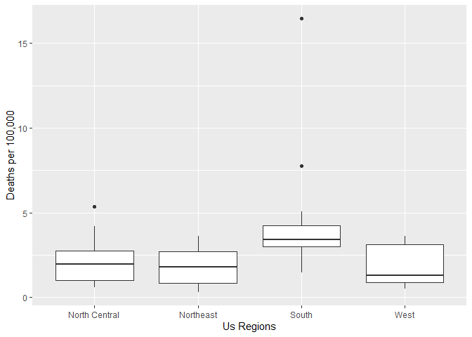

Report
================
Samuel Pereira
26/11/2020

## Introduction

In this report I’ll make a few points about the data on morders in US
territory, I hope this little project of mine can server as a start for
your own data analysis and repors.

Using this libraries:  
1\. ggplo2  
2\. tidyverse

And the data wrangled using the handler script

``` r
load("rda/murders.rda")
```

## Overview

    ##    Min. 1st Qu.  Median    Mean 3rd Qu.    Max. 
    ##  0.3196  1.2526  2.6871  2.7791  3.3861 16.4528

This the average death rate of the USA looks a little high if compared
to european countries. However is it fair to judge USA considering such
vast territory and diverse regions?

## deaths across regions

Let’s see how the murder rates are within the country:

<!-- -->
